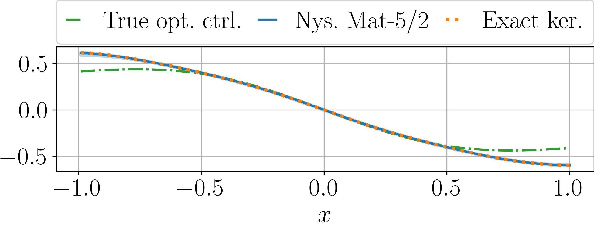
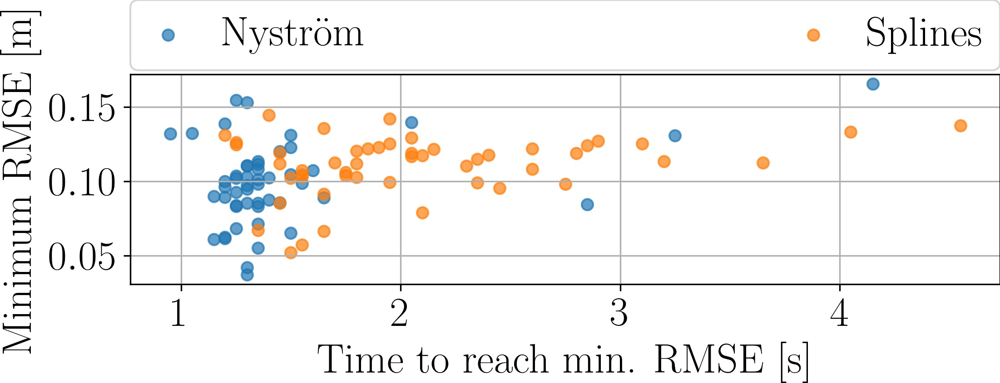

	
Nonlinear dynamical systems pose a great challenge  in terms of system identification and control. A powerful approach to deal with nonlinear systems, originally introduced in the context of autonomous dynamics,  is provided by the <em>Koopman operator</em> framework.
In this approach, the system is transformed through a set of nonlinear functions, called <em>observables</em>, so that the dynamics of the transformed states are <em>globally linear</em>. These lifted dynamics can then be estimated from data, and the model obtained in this way can be used to make approximate forecasts of the state evolution.
When applied to controlled dynamical systems, this technique allows to employ linear control algorithms, e.g., the linear quadratic regulator (LQR), which are well understood and efficient to compute.
In this case, the Koopman framework entails extending the state space, so that the control variable is seen as an additional state of the system.

To capture the dynamics, and design a suitable control law based on that, the choice of the observable space is crucial. Recently, a lot of attention has been put on the Reproducing Kernel Hilbert Space (RKHS) as an observable space. This space is appealing as it allows to derive guarantees when approximating, i.e., learning the Koopman operator from data. However,  obtaining such an estimator comes at a high computational cost. 
Our recent paper, <a href="https://doi.org/10.1016/j.automatica.2025.112302" target="_blank" class="link"><em>Linear quadratic control of nonlinear systems with Koopman operator learning and the Nystr&ouml;m method</em></a>, tackles the computational challenges associated to Koopman operator learning in RKHSs, by means of the so-called <em>Nyström approximation</em>.

<h2>The Koopman approach: Lifting to the RKHS</h2>

Let the state space be $ \mathbb{R}^d$ and the control space be $ \mathbb{R}^{n\_u}$. For $f:\mathbb R^d\times \mathbb R^{n\_u}\to \mathbb R^d$, we consider a nonlinear dynamical system $x\_{t+1} = f(x\_t, u\_t)$.

In the Koopman approach, we lift the state to an RKHS $\mathcal{H}\_1$ defined by a positive definite kernel $k: \mathbb{R}^d \times \mathbb{R}^d \to \mathbb{R}$, with associated feature map $\psi(x) \mathrel{:=} k(x, \cdot)$. In order to account for the control inputs, we can further define the augmented lifted state in the space $\mathcal{H} := \mathcal{H}\_1 \times \mathbb{R}^{n\_u}$, by means of the feature map $\phi(x, u) := \begin{bmatrix}\psi(x)\\\\ u\end{bmatrix}$.

The goal is to learn a linear operator $G\_\gamma: \mathcal{H} \to \mathcal{H}\_1$ that approximates the dynamics of the lifted state. Given $n$ training tuples of the form $(x\_i, u\_i, f(x\_i, u\_i))_{i=\\{1,\dots,n\\}}$, we formulate the following regularized least-squares problem:

$$
G_{\gamma} := \arg \min_{W: \mathcal{H} \to \mathcal{H}_1} \sum_{i=1}^n\|\psi(f(x_{i}, u_i)) - W\phi(x_i, u_i)\|_{\mathcal H_1}^2 + \gamma \|W\|_{\textrm{HS}}^2
$$

where $\lVert\cdot\rVert\_{\textrm{HS}}$ denotes the Hilbert-Schmidt norm.

<h2>The Computational Bottleneck: Operator Inversion</h2>

The analytical solution to the minimization problem above involves the inversion of the Gram matrix of the data. For a dataset of size $n$, this inversion scales as $\mathcal{O}(n^3)$. This cubic complexity renders the exact kernel method intractable.

<h4>The Nyström Approximation: Subspace Projection</h4>

To mitigate this, we employ the <em>Nyström method</em>. Mathematically, this corresponds to projecting the dynamics onto finite-dimensional subspaces spanned by a subset of $m$  <em>landmark</em> points, obtained by sub-sampling the training set. Note that, typically, $m\ll n$.

Let $\mathcal{H}\_\textrm{in}$ resp. $\mathcal{H}\_\textrm{out}$ be subspaces spanned by $m$ input resp. output landmarks. The approximate operator $\tilde{G}\_\gamma$ is obtained by restricting the optimization to these subspaces:

$$
\tilde{G}_{\gamma} =\arg\min_{W:\mathcal H\to \mathcal H_1} \mathcal \sum_{i=1}^n\|\psi(f(x_i, u_i)) - \Pi_\textrm{out} W\Pi_\textrm{in}\phi(x_i, u_i)\|_{\mathcal H_1}^2 + \gamma\|{W} \|_{\textrm{HS}}^2
$$

where $\Pi\_\textrm{in}$ and $\Pi\_\textrm{out}$ are orthogonal projectors onto the chosen subspaces. This reduction allows the infinite-dimensional dynamics to be represented by a finite-dimensional linear system of size $m$, where the transition matrices are computed via kernel evaluations at the landmarks and training points.

<h2>Theoretical Guarantees: Convergence Rates</h2>

A major contribution of our work is the derivation of finite-sample error bounds. We analyze how the error introduced by the Nyström projection propagates through the learning pipeline to the solution of an LQR optimal control problem.

<h4>Operator Convergence</h4>
Assuming the kernel is bounded and the regularization $\gamma$ is fixed, the difference between the Nyström-approximated operator $\tilde{G}\_\gamma$ and the exact kernel operator $G\_\gamma$ is bounded in operator norm with probability $1-\delta$:

$$
\left\|\tilde{G}_{\gamma} - G_{\gamma}\right\| \le \mathcal{O}\left(m^{-1/2}\right)
$$

<h4>Riccati Operator Stability</h4>
In the LQR setting, the optimal control is determined by the unique positive semi-definite solution $P$ to the discrete algebraic Riccati equation. We prove that the approximation error in the Riccati operator scales linearly with the operator estimation error, i.e., 

$$
\|P - \tilde{P}\| \le \mathcal{O}(\epsilon) \implies \|P - \tilde{P}\| \le \mathcal{O}\left(m^{-1/2}\right)
$$

where $\epsilon$ is the bound on the operator error $\left\lVert\tilde{G}\_{\gamma} - G\_{\gamma}\right\rVert$.

<h4>Optimality of the Control Objective</h4>
Based on this result, we further derive the convergence rate of the error in the LQR objective function (i.e., the cost of the control strategy). Let $\mathcal{J}$ be the cost of the true optimal control and $\hat{\mathcal{J}}$ is the cost of the control derived from the Nyström approximation. The following rate is derived:

$$
\hat{\mathcal{J}} - \mathcal{J} \le \mathcal{O}\left(m^{-1}\right)
$$

This result indicates that the controller performance is highly robust to the approximation errors introduced by the Nyström method.

<h2>Numerical Validation</h2>

  
  
<em>Figure 1: Our Nyström-based methodology recovers a good approximation of the known optimal control on a proof-of-concept, one dimensional nonlinear system.</em>

  
  
<em>Figure 2: Using the Nyström-based embedding allows to reach the target pose in the cloth swing motion in a faster and more reliable way as opposed to other state-space lifting functions.</em>

The efficacy of this approach was validated on a proof-of-concept experiment, on the _Duffing oscillator_ and a high-dimensional _robotic cloth manipulation_ simulated task.

* In the proof-of-concept dynamics, for which we know the optimal stabilizing control law, we show that our Nyström-based LQR algorithm retrieves a good approximation of the optimal control law, see [Figure 1](#fig-poc).
* In the Duffing oscillator experiment, the Nyström method provides a more stable basis for control than competitive baselines. 
* In the cloth manipulation experiment, which involved learning motions that resemble a tablecloth placement skill, the method successfully compressed the 192-dimensional state space into a tractable representation, achieving faster convergence to the target pose than competing baseline methods, see [Figure 2](#fig-cloth-swing). The goal here is to achieve a pose  in which the cloth is rotated by 45 degrees about the upper corners, before gravity drags back the cloth towards the floor.

<h2>Conclusion</h2>

This research formalizes the link between RKHS embeddings and linear control theory. By leveraging the Nyström method, we can trade a controlled amount of approximation error (scaling as $m^{-1}$ in the control objective) for significant computational gains. 

